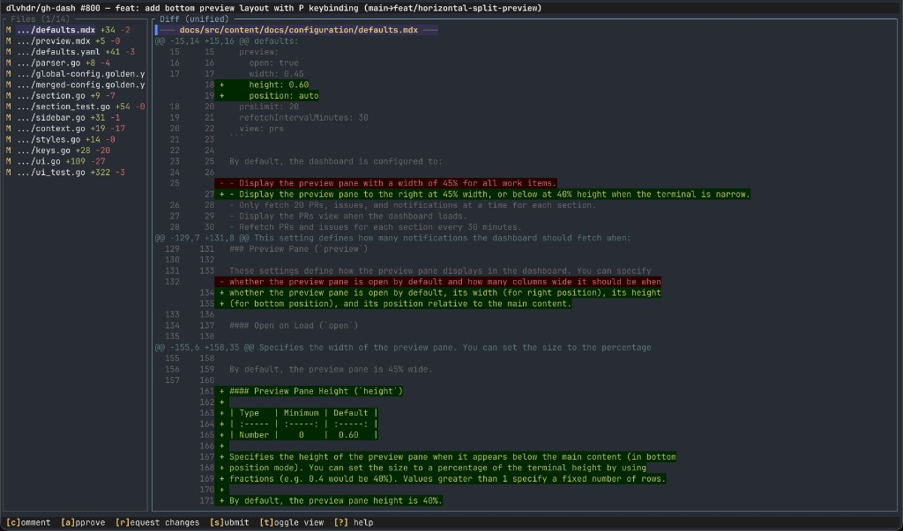

# gh-review

Terminal UI for reviewing GitHub pull requests. View diffs (unified and side-by-side), comment on lines, suggest changes, resolve threads, expand context, and approve — all without leaving the terminal.



## Install

```bash
cargo install gh-review
```

Requires the [GitHub CLI](https://cli.github.com/) (`gh`) to be installed and authenticated.

## Usage

```bash
gh-review <OWNER/REPO> <PR_NUMBER>
```

```bash
gh-review octocat/hello-world 42
```

### With gh-dash

[gh-dash](https://github.com/dlvhdr/gh-dash) is a terminal dashboard for GitHub PRs, issues, and notifications. gh-review is designed to complement it — use gh-dash to browse and triage, press a key to jump into gh-review for deep code review.

#### Setup

1. Install gh-dash if you haven't already:

   ```bash
   gh extension install dlvhdr/gh-dash
   ```

2. Add a custom keybinding to `~/.config/gh-dash/config.yml`:

   ```yaml
   keybindings:
     prs:
       - key: R
         name: review (gh-review)
         command: >
           gh-review {{.RepoName}} {{.PrNumber}}
   ```

   `{{.RepoName}}` and `{{.PrNumber}}` are template variables that gh-dash fills in with the currently selected PR.

3. Run gh-dash:

   ```bash
   gh dash
   ```

4. Navigate to a PR and press `R`. gh-dash suspends and gh-review takes over the terminal. When you quit gh-review (`q`), you're back in gh-dash.

#### Workflow

```
gh-dash (browse PRs)
  │
  ├─ R  → gh-review (diff, comment, approve)
  ├─ D  → delta side-by-side diff (quick read-only view)
  ├─ d  → unified diff in pager
  └─ V  → approve directly
```

## Keybindings

### Navigation

| Key | Action |
|-----|--------|
| `j` / `k` / `↑` / `↓` | Scroll line |
| `gg` / `G` | Go to first / last line |
| `Ctrl+D` / `Ctrl+U` | Half page down / up |
| `Ctrl+F` / `Ctrl+B` | Full page down / up |
| `H` / `M` / `L` | Cursor to screen top / middle / bottom |
| `]` / `}` | Next hunk |
| `[` / `{` | Previous hunk |
| `)` / `(` | Next / previous change |
| `n` / `N` | Next / previous file (or search match when search active) |
| `zz` / `zt` / `zb` | Center / top / bottom cursor in viewport |
| `Tab` | Switch focus between file list and diff |

### Search

| Key | Action |
|-----|--------|
| `/` | Search forward (regex, smart-case) |
| `?` | Search backward (in diff view) |
| `n` / `N` | Next / previous search match |
| `Esc` | Cancel search and restore cursor |
| `Enter` | Confirm search |

In the file picker, `/` opens a fuzzy file filter instead.

### Diff

| Key | Action |
|-----|--------|
| `t` | Toggle unified / side-by-side view |
| `e` | Suggest change on current line |
| `E` | Expand context around cursor (+10 lines) |

### Review

| Key | Action |
|-----|--------|
| `c` | Comment on current line (or edit pending / reply) |
| `v` | Visual select mode for multi-line comments |
| `x` | Discard pending comment at cursor |
| `Ctrl+S` | Save comment / confirm review (in textarea modals) |
| `Esc` | Cancel comment / cancel visual selection |
| `a` | Approve (quick confirm) |
| `r` | Request changes (quick confirm) |
| `s` | Submit review as comment-only (quick confirm) |
| `u` | Unapprove — dismiss your own approval |
| `R` | Resolve / unresolve comment thread |
| `y` | Accept suggestion (apply as commit) |

Comments are batched into a pending review and submitted together when you press `a`, `r`, or `s`. These open a quick confirm popup (Enter / Esc). For review submissions with a body message, use the `:` command mode (see below).

### Command Mode

Press `:` to open the command prompt. Type a command name and press Enter to execute. Tab cycles through completions.

| Command | Action |
|---------|--------|
| `:approve` | Approve (quick confirm) |
| `:approve_with_comment` | Approve with review body |
| `:request_changes` | Request changes (quick confirm) |
| `:request_changes_with_comment` | Request changes with body |
| `:submit` | Submit comment-only (quick confirm) |
| `:comment` | Review comment with body |
| `:unapprove` | Dismiss own approval |
| `:suggest` | Suggest change on current line |
| `:expand` | Expand context |
| `:discard` | Discard pending comment |
| `:resolve` | Resolve / unresolve thread |
| `:accept_suggestion` | Accept suggestion |
| `:toggle_view` | Toggle unified / side-by-side |
| `:help` | Toggle help overlay |
| `:quit` (or `:q`) | Quit |
| `:open_browser` | Open PR in browser |

### Other

| Key | Action |
|-----|--------|
| `:` | Open command prompt |
| `o` | Open PR in browser |
| `!` | Show help overlay |
| `q` | Quit |

## Architecture

```
src/
  main.rs                  CLI entry point (clap), terminal setup
  event.rs                 Async event channel (crossterm + tokio)
  gh.rs                    GitHub API via gh CLI subprocess (REST + GraphQL)
  types.rs                 Domain types (DiffFile, Hunk, ReviewComment, etc.)
  theme.rs                 Colors and styles
  highlight.rs             Syntax highlighting (arborium)
  app/
    mod.rs                 App struct, state, event dispatch, data loading
    command.rs             Command struct, registry macro, handler functions
    keymap.rs              Configurable key-to-command mapping (HashMap)
    handlers.rs            Modal key handlers, async commands
    ui.rs                  Layout and drawing
  diff/
    model.rs               DisplayRow types and display row builder
    renderer.rs            Unified + side-by-side row rendering
    parser.rs              Parse unified diff patches into structured hunks
    expand.rs              Fetch and splice expanded context lines
  search/
    mod.rs                 Regex search engine with match navigation
    tests.rs               Search unit tests
  components/
    diff_view/
      mod.rs               Scrollable diff viewport state and query helpers
      navigation.rs        Vim-style cursor movement (scroll, jump, page)
      draw.rs              Unified and side-by-side rendering
    file_picker.rs         File list sidebar with fuzzy filter
    comment_input.rs       Inline comment textarea popup
    command_bar.rs         Command mode prompt with tab completion
    search_bar.rs          Search prompt with match count display
    review_bar.rs          Bottom status bar
    review_confirm.rs      Review submission confirmation popup
    help.rs                Keybinding help overlay
```

Key handling follows the **Helix command pattern**: each action is a `Command` struct with name, doc, and handler fn pointer, registered via a `define_commands!` macro. A `Keymap` maps key combos to commands via `HashMap`. The `:` command mode looks up commands by name from the same registry. Modal states (search bar, comment input, review confirm, command bar, file filter, help) each have dedicated handlers.

All GitHub API calls go through the `gh` CLI, reusing your existing authentication. No tokens or OAuth configuration needed.

## Roadmap

See [docs/ROADMAP.md](docs/ROADMAP.md) for planned features including stacked PR support, syntax highlighting, configuration, and more.

## Contributing

Contributions are welcome! Please read [CONTRIBUTING.md](CONTRIBUTING.md) for guidelines on how to get started, submit pull requests, and report issues.

This project follows the [Contributor Covenant Code of Conduct](CODE_OF_CONDUCT.md).

## License

[MIT](LICENSE)
