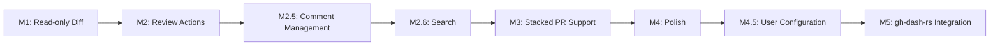
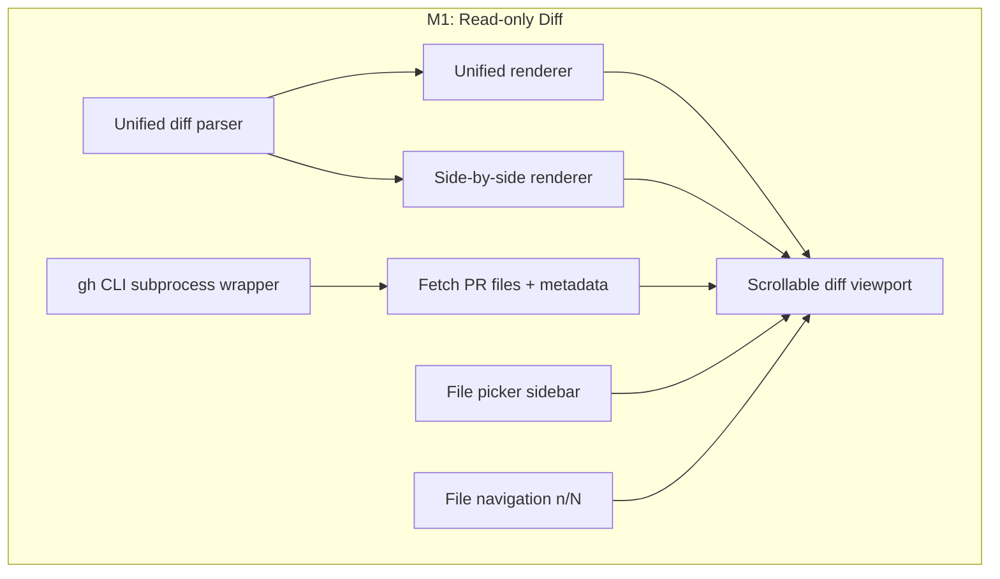
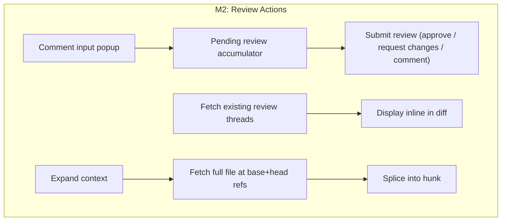
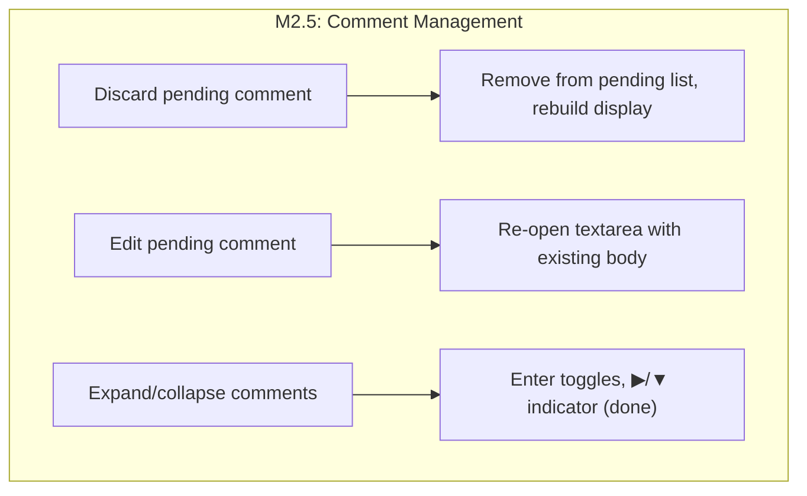
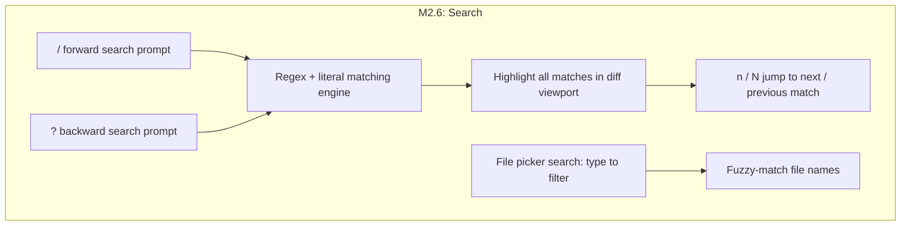
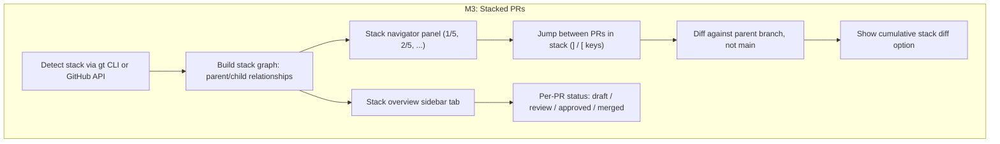
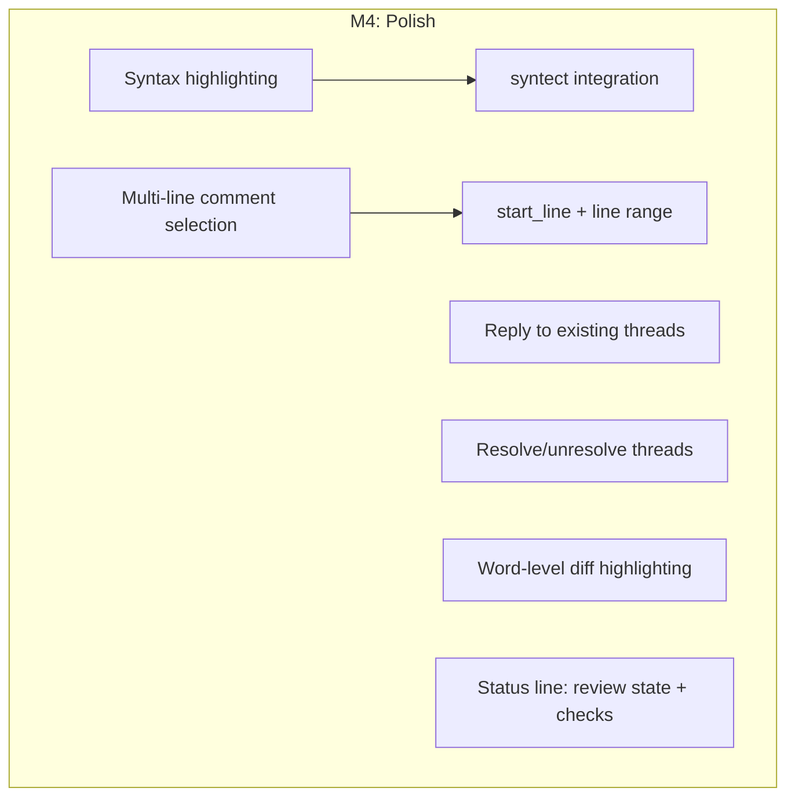
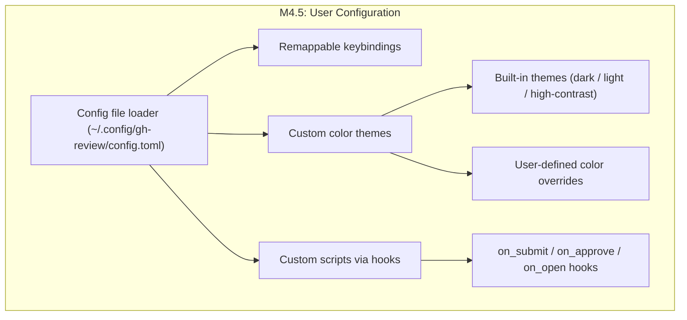
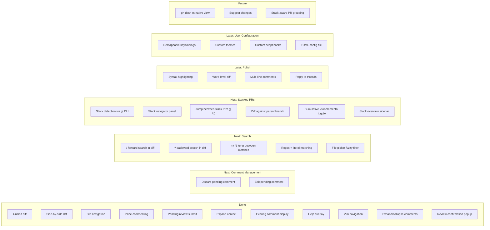

# gh-review Roadmap

## Overview



## Milestones

### M1 — Read-only Diff Viewer (done)



- Parse GitHub patch format into structured hunks
- Unified and side-by-side rendering with syntax-colored +/- lines
- Dual-number gutters (old line / new line)
- File list sidebar with status indicators and +/- counts
- Keyboard navigation: scroll, page, jump to file, toggle view mode

### M2 — Review Actions (done)



- Inline comment textarea anchored to cursor line
- Pending review model — batch comments, submit as one review
- Approve, request changes, and comment-only submission with confirmation popup
- Existing review comments displayed inline in the diff
- Expandable context — fetch full file content and splice +10 lines
- Expand/collapse multi-line comments with Enter
- Vim-style navigation (gg, G, H/M/L, ]/[, zz/zt/zb, Ctrl+F/B)
- Clean process shutdown (works as gh-dash subprocess)

### M2.5 — Comment Management (next)



- **Discard pending comment** — cursor on a pending comment, press `x` or `d` to remove it from the pending review
- **Edit pending comment** — cursor on a pending comment, press `c` or `e` to re-open the textarea pre-filled with the existing body
- Expand/collapse multi-line comments — done (Enter to toggle)

### M2.6 — Search

Vim-style search across diff content and file names, matching the `/` and `?` patterns familiar to vim and less users.



**Diff search (`/` and `?`)**
- `/` opens a search prompt at the bottom of the screen (forward search)
- `?` opens search in reverse direction (when help overlay is not active)
- Supports literal and regex patterns
- All matches highlighted in the diff viewport with a distinct style
- `n` jumps to next match, `N` jumps to previous match
- Search wraps around at end/beginning of diff
- `Esc` or `Enter` on empty input exits search mode
- Matches persist until a new search or explicit clear

**File picker search**
- When file picker is focused, typing `/` activates a filter prompt
- Fuzzy matching against file paths (e.g. `comp/diff` matches `src/components/diff_view.rs`)
- Filtered list updates as you type, press `Enter` to select, `Esc` to cancel

**Keybinding considerations**
- `n`/`N` currently navigate files — when a search is active, they switch to search navigation; when no search is active, they retain file navigation behavior
- `?` currently shows help — resolve by using `?` for search only in diff view and keeping `?` for help in other contexts, or by moving help to `F1`

### M3 — Stacked PR Support

Graphite stacked PRs require reviewing each PR against its parent branch (not main), navigating between PRs in a stack, and understanding where a PR sits in the dependency chain.



**Stack detection**
- Run `gt stack` or parse PR base branches to detect the stack
- Each PR in a Graphite stack targets its parent PR's branch as the base, not `main`
- Build an ordered list: `main ← PR#1 ← PR#2 ← PR#3`

**Stack navigation**
- Show stack position in title bar: `[2/5] ROKT/srs #1234 — Add feature X`
- `]` / `[` keys to move to next/previous PR in the stack
- Loading the next PR fetches its diff and comments without quitting

**Stack-aware diffing**
- Default: diff each PR against its parent branch (incremental changes only)
- Toggle: show cumulative diff from `main` to current PR (full picture)
- Visual indicator when viewing incremental vs cumulative

**Stack overview**
- Sidebar tab showing the full stack as a vertical list
- Each PR shows: number, title, review status, CI status
- Highlight the currently viewed PR
- Jump to any PR in the stack by selecting it

**CLI changes**
```
gh-review ROKT/srs 1234              # single PR (existing)
gh-review ROKT/srs 1234 --stack      # auto-detect stack, start at this PR
gh-review ROKT/srs --stack 1234 1235 1236  # explicit stack order
```

### M4 — Polish



- Syntax highlighting for diff content (Rust, Go, Python, TypeScript, etc.)
- Word-level diff within changed lines (highlight the exact characters that changed)
- Multi-line comment selection (visual select a range, then comment)
- Reply to and resolve existing review threads
- Status line showing PR review state and CI check status

### M4.5 — User Configuration

User-facing config file (`~/.config/gh-review/config.toml`) for personalizing the tool without recompiling.



**Config file**
- TOML config at `~/.config/gh-review/config.toml` (XDG-compliant)
- CLI flags override config values
- Sensible defaults when no config file exists

**Remappable keybindings**
- Every action (scroll, comment, submit, search, etc.) can be rebound
- Config section `[keys]` with action-name = key-combo mapping
- Support modifier combinations (Ctrl, Alt, Shift)
- Validation on startup — warn on conflicts or unknown actions

```toml
[keys]
scroll_down = "j"
scroll_up = "k"
submit_approve = "a"
search_forward = "/"
next_file = "n"
```

**Custom themes**
- Built-in themes: dark (default), light, high-contrast
- Select via config: `theme = "light"`
- Full color override via `[theme.colors]` section for diff add/remove, comments, UI chrome, search highlights
- Terminal capability detection (256-color, truecolor, basic)

```toml
theme = "dark"

[theme.colors]
add_bg = "#1a3a1a"
remove_bg = "#3a1a1a"
comment_fg = "#f0c674"
search_match = "#ffcc00"
```

**Custom scripts**
- Hook system: run user-defined shell commands on review lifecycle events
- Supported hooks: `on_open`, `on_submit`, `on_approve`, `on_request_changes`, `on_quit`
- Scripts receive context as environment variables (`GH_REVIEW_REPO`, `GH_REVIEW_PR`, `GH_REVIEW_ACTION`)
- Async execution — scripts run in background, don't block the UI

```toml
[hooks]
on_approve = "notify-send 'PR approved' '$GH_REVIEW_REPO#$GH_REVIEW_PR'"
on_submit = "~/.config/gh-review/scripts/post-review.sh"
```

### M5 — gh-dash-rs Integration (future)


- Extract `diff/` and `components/` into a reusable library crate
- Replace `gh` CLI subprocess calls with direct API calls via `gh-dash-github`
- Embed as a native view inside the gh-dash Rust rewrite
- Seamless transition: PR list → review view → back, no process suspension
- Stack-aware PR grouping in the dashboard list view

## Feature Matrix


