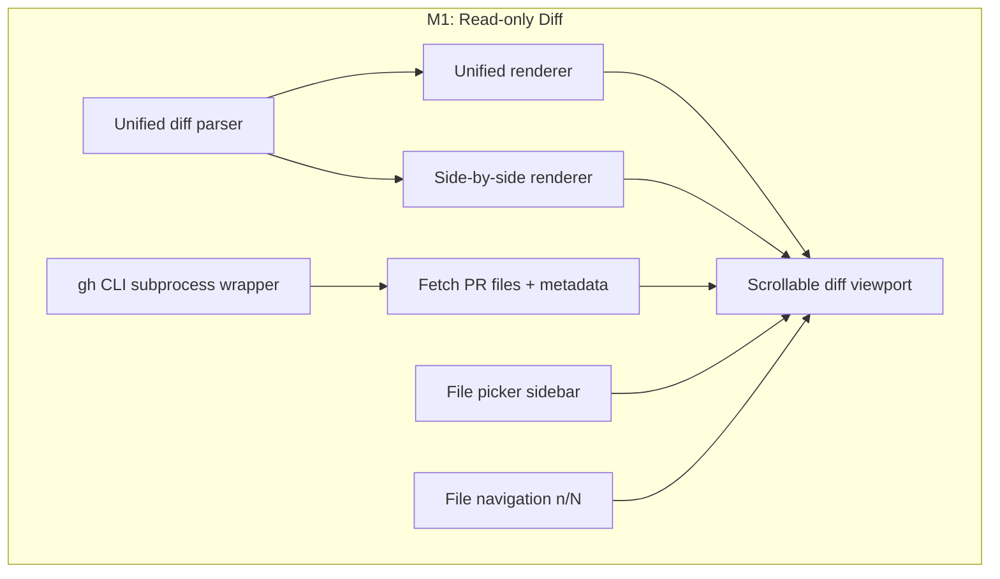
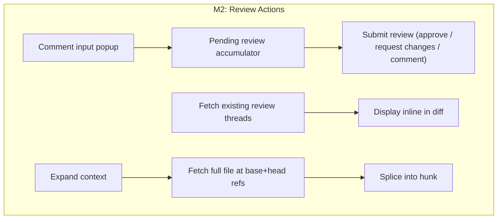
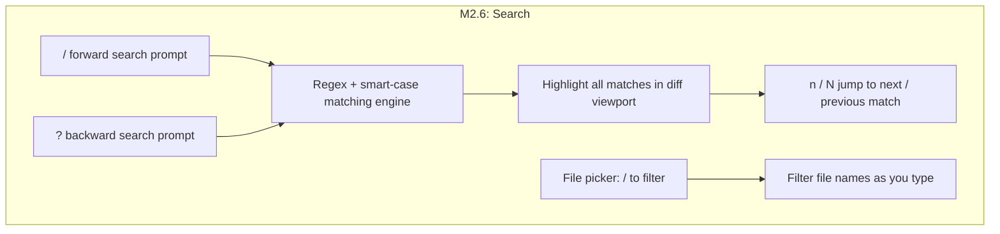
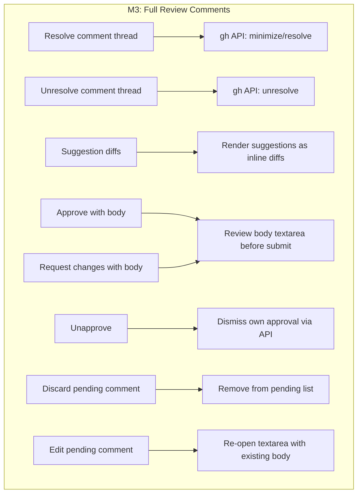
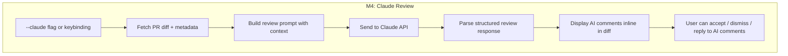
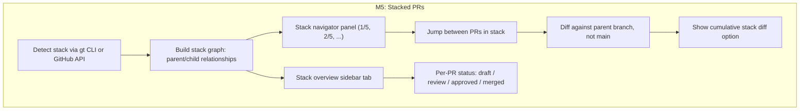
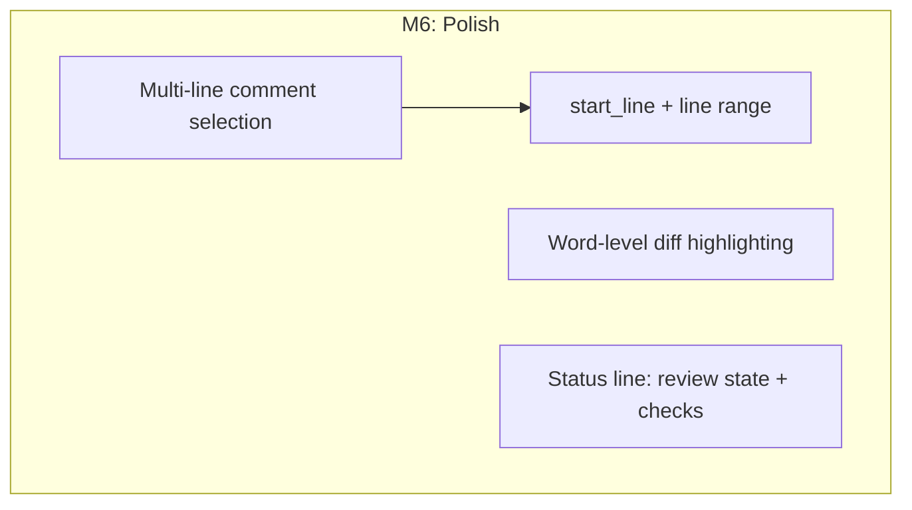
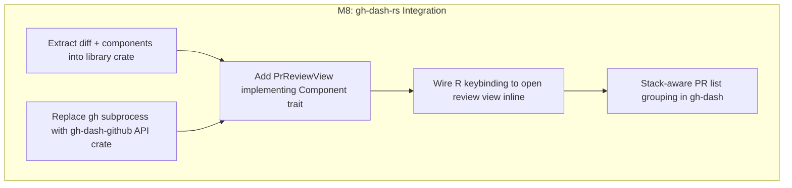

# gh-review Roadmap

## Overview

| Milestone | Description | Status |
|-----------|-------------|--------|
| M1 — Read-only Diff Viewer | Parse diffs, unified + side-by-side rendering, file picker | done |
| M2 — Review Actions | Inline comments, pending review submit, expand context, syntax highlighting | done |
| M2.6 — Search | Regex search with smart-case, match highlighting, file picker filter | done |
| M3 — Full Review Comments | Resolve/unresolve threads, suggestion diffs, review body, unapprove | **next** |
| M4 — Claude Review | AI-powered code review via Claude API, inline comment display | planned |
| M5 — Graphite Stacked PRs | Stack detection, navigate between PRs, diff against parent branch | planned |
| M6 — Polish | Word-level diff, multi-line comments, status line | later |
| M7 — User Configuration | TOML config, remappable keybindings, custom themes, script hooks | later |
| M8 — gh-dash-rs Integration | Library crate extraction, native view inside gh-dash Rust rewrite | future |
| M9 — AI Chat Panel | Side-by-side chat panel for discussing code with Claude while reviewing | future |

## Milestones

### M1 — Read-only Diff Viewer (done)



- Parse GitHub patch format into structured hunks
- Unified and side-by-side rendering with syntax-colored +/- lines
- Dual-number gutters (old line / new line)
- File list sidebar with status indicators and +/- counts
- Keyboard navigation: scroll, page, jump to file, toggle view mode

### M2 — Review Actions (done)



- Inline comment textarea anchored to cursor line
- Pending review model — batch comments, submit as one review
- Approve, request changes, and comment-only submission with confirmation popup
- Existing review comments displayed inline in the diff
- Expandable context — fetch full file content and splice +10 lines
- Expand/collapse multi-line comments with Enter
- Vim-style navigation (gg, G, H/M/L, ]/[, zz/zt/zb, Ctrl+F/B)
- Clean process shutdown (works as gh-dash subprocess)

### M2.6 — Search (done)

Vim-style search across diff content and file names.



**Diff search (`/` and `?`)**
- `/` opens a search prompt at the bottom of the screen (forward search)
- `?` opens search in reverse direction (in diff view)
- Regex patterns with smart-case (case-insensitive unless pattern contains uppercase)
- Invalid regex silently escaped to a literal match
- All matches highlighted in the diff viewport; current match gets a distinct style
- `n` jumps to next match, `N` jumps to previous match; wraps at boundaries
- `Esc` cancels search and restores cursor to pre-search position
- `Enter` confirms search; match count displayed in search bar (`[3/12]`)

**File picker filter**
- When file picker is focused, `/` activates a filter prompt
- Filter against file paths; list updates as you type
- `j`/`k` navigate filtered results, `Enter` to select, `Esc` to cancel

**Resolved keybinding decisions**
- `n`/`N` are dual-purpose: search navigation when a search is active, file navigation otherwise
- `?` opens backward search in diff view, shows help overlay in file picker
- Help is also available via `F1` in all contexts

### M3 — Full Review Comments (next)

Complete the review comment workflow to cover all standard GitHub review operations.



**Resolve / unresolve threads**
- Cursor on a comment thread, press a key to resolve (hide) or unresolve (unhide)
- Uses the GitHub GraphQL API to minimize/resolve the thread
- Resolved threads shown as collapsed with a visual indicator

**Suggestion diffs**
- Press `e` on a diff line to open the line content in an editable textarea
- Edit freely — on save, compute the diff between original and edited text and auto-generate the GitHub ```` ```suggestion ```` block
- Existing suggestion comments rendered as inline diffs showing the proposed change (old line -> suggested line)
- Accept suggestion: apply as a commit directly from the TUI via GitHub API

**Review submission with body**
- When pressing `a` (approve), `r` (request changes), or `s` (comment), a textarea opens for the review body before submitting
- Body is optional — submit empty to skip, just like the GitHub web UI
- Pending comments are listed in the confirmation popup as a summary

**Unapprove**
- Dismiss your own prior approval via the GitHub API
- Keybinding to unapprove with an optional body explaining why

**Pending comment management**
- Discard pending comment — cursor on a pending comment, press `x` to remove from the pending review
- Edit pending comment — cursor on a pending comment, press `c` to re-open the textarea pre-filled with the existing body

### M4 — Claude Review (planned)

AI-powered code review using Claude. Send the PR diff and context to Claude for automated review feedback displayed inline.



**Diff-based review**
- Send the unified diff, PR title, description, and file list to Claude
- Claude returns structured review comments (file, line, body, severity)
- AI comments displayed inline in the diff alongside human comments, visually distinct
- User can accept (convert to a real review comment), dismiss, or reply

**Integration**
- `--claude` CLI flag triggers AI review on PR load
- In-app keybinding to request Claude review on demand
- API key configured via environment variable (`ANTHROPIC_API_KEY`) or config file
- Rate limiting and cost awareness — show token usage in status bar

**Review quality**
- Context-aware: include file paths, hunk context, and PR description
- Configurable review focus (security, performance, correctness, style)
- Severity levels: error, warning, suggestion, nit

### M5 — Graphite Stacked PRs (planned)

Graphite stacked PRs require reviewing each PR against its parent branch (not main), navigating between PRs in a stack, and understanding where a PR sits in the dependency chain.



**Stack detection**
- Run `gt stack` or parse PR base branches to detect the stack
- Each PR in a Graphite stack targets its parent PR's branch as the base, not `main`
- Build an ordered list: `main <- PR#1 <- PR#2 <- PR#3`

**Stack navigation**
- Show stack position in title bar: `[2/5] ROKT/srs #1234 — Add feature X`
- `]` / `[` keys to move to next/previous PR in the stack
- Loading the next PR fetches its diff and comments without quitting

**Stack-aware diffing**
- Default: diff each PR against its parent branch (incremental changes only)
- Toggle: show cumulative diff from `main` to current PR (full picture)
- Visual indicator when viewing incremental vs cumulative

**Stack overview**
- Sidebar tab showing the full stack as a vertical list
- Each PR shows: number, title, review status, CI status
- Highlight the currently viewed PR
- Jump to any PR in the stack by selecting it

**CLI changes**
```
gh-review ROKT/srs 1234              # single PR (existing)
gh-review ROKT/srs 1234 --stack      # auto-detect stack, start at this PR
gh-review ROKT/srs --stack 1234 1235 1236  # explicit stack order
```

### M6 — Polish (later)



- Word-level diff within changed lines (highlight the exact characters that changed)
- Multi-line comment selection (visual select a range, then comment)
- Status line showing PR review state and CI check status

### M7 — User Configuration (later)

User-facing config file (`~/.config/gh-review/config.toml`) for personalizing the tool without recompiling.


**Config file**
- TOML config at `~/.config/gh-review/config.toml` (XDG-compliant)
- CLI flags override config values
- Sensible defaults when no config file exists

**Remappable keybindings**
- Every action (scroll, comment, submit, search, etc.) can be rebound
- Config section `[keys]` with action-name = key-combo mapping
- Support modifier combinations (Ctrl, Alt, Shift)
- Validation on startup — warn on conflicts or unknown actions

```toml
[keys]
scroll_down = "j"
scroll_up = "k"
submit_approve = "a"
search_forward = "/"
next_file = "n"
```

**Custom themes**
- Built-in themes: dark (default), light, high-contrast
- Select via config: `theme = "light"`
- Full color override via `[theme.colors]` section for diff add/remove, comments, UI chrome, search highlights
- Terminal capability detection (256-color, truecolor, basic)

```toml
theme = "dark"

[theme.colors]
add_bg = "#1a3a1a"
remove_bg = "#3a1a1a"
comment_fg = "#f0c674"
search_match = "#ffcc00"
```

**Custom scripts**
- Hook system: run user-defined shell commands on review lifecycle events
- Supported hooks: `on_open`, `on_submit`, `on_approve`, `on_request_changes`, `on_quit`
- Scripts receive context as environment variables (`GH_REVIEW_REPO`, `GH_REVIEW_PR`, `GH_REVIEW_ACTION`)
- Async execution — scripts run in background, don't block the UI

```toml
[hooks]
on_approve = "notify-send 'PR approved' '$GH_REVIEW_REPO#$GH_REVIEW_PR'"
on_submit = "~/.config/gh-review/scripts/post-review.sh"
```

### M8 — gh-dash-rs Integration (future)



- Extract `diff/` and `components/` into a reusable library crate
- Replace `gh` CLI subprocess calls with direct API calls via `gh-dash-github`
- Embed as a native view inside the gh-dash Rust rewrite
- Seamless transition: PR list -> review view -> back, no process suspension
- Stack-aware PR grouping in the dashboard list view

### M9 — AI Chat Panel (future)

Side-by-side chat panel for discussing code with Claude while reviewing a PR.

- Split the screen: diff on the left, chat on the right
- Ask Claude about specific lines, functions, or design decisions with full diff context
- Chat history persists for the duration of the review session
- Reference code by selecting lines in the diff — context auto-injected into the chat
- Claude responses can be converted into review comments with one key

## Feature Matrix

| Status | Feature |
|--------|---------|
| done | Unified diff |
| done | Side-by-side diff |
| done | File navigation |
| done | Inline commenting |
| done | Pending review submit |
| done | Expand context |
| done | Existing comment display |
| done | Help overlay |
| done | Vim navigation |
| done | Expand/collapse comments |
| done | Review confirmation popup |
| done | Reply to comment threads |
| done | `/` forward search in diff |
| done | `?` backward search in diff |
| done | `n` / `N` jump between matches |
| done | Regex + smart-case matching |
| done | File picker filter |
| done | Syntax highlighting |
| **next** | Resolve / unresolve comment threads |
| **next** | Suggestion diffs (render + create + accept) |
| **next** | Approve / request changes with body |
| **next** | Unapprove with body |
| **next** | Discard pending comment |
| **next** | Edit pending comment |
| planned | Claude AI review |
| planned | Stack detection via gt CLI |
| planned | Stack navigator panel |
| planned | Jump between stack PRs |
| planned | Diff against parent branch |
| planned | Cumulative vs incremental toggle |
| planned | Stack overview sidebar |
| later | Word-level diff |
| later | Multi-line comments |
| later | Remappable keybindings |
| later | Custom themes |
| later | Custom script hooks |
| future | gh-dash-rs native view |
| future | Stack-aware PR grouping |
| future | AI chat panel (side-by-side with diff) |
