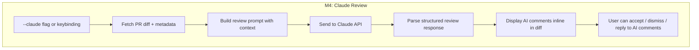
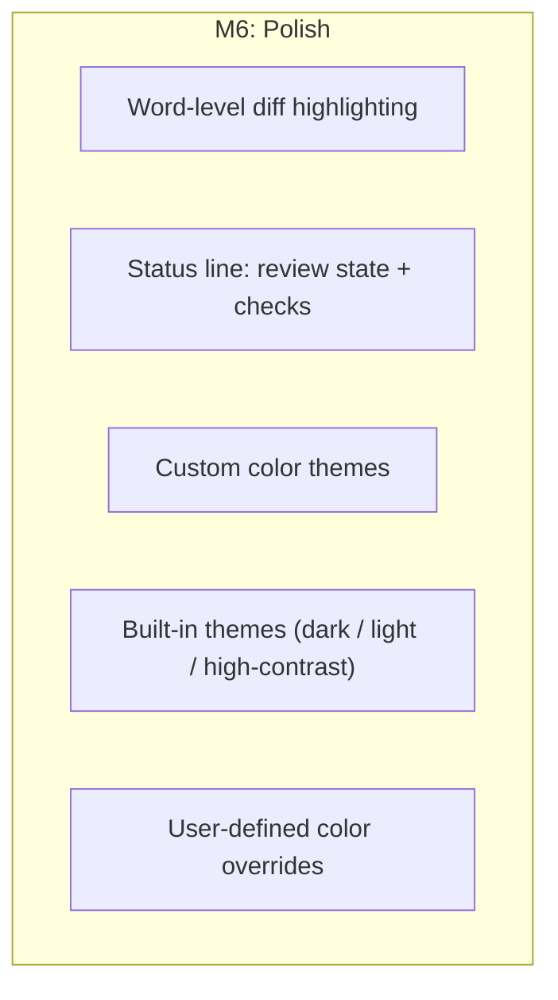
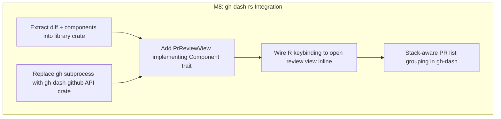

# gh-review Roadmap

## Overview

| Milestone | Description | Status |
|-----------|-------------|--------|
| M1 — Read-only Diff Viewer | Parse diffs, unified + side-by-side rendering, file picker | done |
| M2 — Review Actions | Inline comments, pending review submit, expand context, syntax highlighting | done |
| M2.6 — Search | Regex search with smart-case, match highlighting, file picker filter | done |
| M3 — Full Review Comments | Resolve/unresolve threads, suggestion diffs, review body, unapprove | done |
| M7 — User Configuration | TOML config, remappable keybindings, custom actions | done |
| M4.5 — PR Description Panel | View and edit PR description, panel navigation, scoped command system | done |
| M5 — Graphite Stacked PRs | Stack detection, navigate between PRs, GraphQL pre-fetch, PR cache | done |
| M4 — Claude Review | AI-powered code review via Claude API, inline comment display | **next** |
| M6 — Polish | Word-level diff, status line, custom themes | later |
| M8 — gh-dash-rs Integration | Library crate extraction, native view inside gh-dash Rust rewrite | future |
| M9 — AI Chat Panel | Side-by-side chat panel for discussing code with Claude while reviewing | future |

## Milestones

### M1 — Read-only Diff Viewer (done)

- Parse GitHub patch format into structured hunks
- Unified and side-by-side rendering with syntax-colored +/- lines
- Dual-number gutters (old line / new line)
- File list sidebar with status indicators and +/- counts
- Keyboard navigation: scroll, page, jump to file, toggle view mode
- CLI aliases — invoke with a PR URL or just a PR number when inside the repo
- Debug mode — `--debug` flag to dump resolved config and diagnostics
- Cross-platform support (macOS, Linux, Windows)

### M2 — Review Actions (done)

- Inline comment textarea anchored to cursor line
- Pending review model — batch comments, submit as one review
- Approve, request changes, and comment-only submission with confirmation popup
- Existing review comments displayed inline in the diff with box-drawing thread rendering
- Expandable context — fetch full file content and splice +10 lines; row context expansion with line numbers
- Expand/collapse multi-line comments with Enter; bulk expand/collapse all
- Vim-style navigation (gg, G, H/M/L, ]/[, zz/zt/zb, Ctrl+F/B) with smooth scroll animation
- Syntax highlighting via tree-sitter (arborium, GitHub Dark theme) for unified and side-by-side views
- Command mode — vim-style `:` palette with tab-completion, fuzzy matching, and inline docs
- Collapsible files — `zo`/`zc` or Enter on file header to hide reviewed diffs
- Dynamic keybinding hints that update based on current context and active mode
- Enter to save comments (instead of inserting a newline)
- Open PR in browser (`o`)
- Clean process shutdown (works as gh-dash subprocess)

### M2.6 — Search (done)

Vim-style search across diff content and file names.

**Diff search (`/` and `?`)**
- `/` opens a search prompt at the bottom of the screen (forward search)
- `?` opens search in reverse direction (in diff view)
- Regex patterns with smart-case (case-insensitive unless pattern contains uppercase)
- Invalid regex silently escaped to a literal match
- All matches highlighted in the diff viewport; current match gets a distinct style
- `n` jumps to next match, `N` jumps to previous match; wraps at boundaries
- `Esc` cancels search and restores cursor to pre-search position
- `Enter` confirms search; match count displayed in search bar (`[3/12]`)

**File picker filter**
- When file picker is focused, `/` activates a filter prompt
- Filter against file paths; list updates as you type
- `j`/`k` navigate filtered results, `Enter` to select, `Esc` to cancel

**Resolved keybinding decisions**
- `n`/`N` are dual-purpose: search navigation when a search is active, file navigation otherwise
- `?` opens backward search in diff view, shows help overlay in file picker
- Help is also available via `F1` in all contexts

### M3 — Full Review Comments (done)

Complete the review comment workflow to cover all standard GitHub review operations.

**Resolve / unresolve threads**
- Cursor on a comment thread, press a key to resolve (hide) or unresolve (unhide)
- Uses the GitHub GraphQL API to minimize/resolve the thread
- Resolved threads shown as collapsed with a visual indicator

**Suggestion diffs**
- Press `e` on a diff line to open the line content in an editable textarea
- External editor support — uses `$EDITOR` when available, falls back to built-in text field
- Edit freely — on save, compute the diff between original and edited text and auto-generate the GitHub ```` ```suggestion ```` block
- Existing suggestion comments rendered as rich inline diffs (not plain markdown fences)
- Accept suggestion: apply as a commit directly from the TUI via GitHub API

**Review submission with body**
- When pressing `a` (approve), `r` (request changes), or `s` (comment), a textarea opens for the review body before submitting
- Body is optional — submit empty to skip, just like the GitHub web UI
- Pending comments are listed in the confirmation popup as a summary

**Unapprove**
- Dismiss your own prior approval via the GitHub API
- Keybinding to unapprove with an optional body explaining why

**Pending comment management**
- Discard pending comment — cursor on a pending comment, press `x` to remove from the pending review
- Edit pending comment — cursor on a pending comment, press `c` to re-open the textarea pre-filled with the existing body

**Multi-line comment selection** (pulled forward from M6)
- Press `v` to enter visual select mode (vim-style)
- Navigate to extend the selection; highlighted range shown in the diff
- Press `c` to comment on the selected line range
- `Esc` or `v` again to cancel visual selection
- GitHub API `start_line` and `start_side` fields used for multi-line comment ranges

### M7 — User Configuration (done)

User-facing config file (`~/.config/gh-review/config.toml`) for personalizing the tool without recompiling.

**Config file**
- TOML config at `~/.config/gh-review/config.toml` (XDG-compliant)
- CLI flags override config values
- Sensible defaults when no config file exists

**Remappable keybindings**
- Every action (scroll, comment, submit, search, etc.) can be rebound
- Config section `[keys]` with action-name = key-combo mapping
- Support modifier combinations (Ctrl, Alt, Shift)
- Validation on startup — warn on conflicts or unknown actions

```toml
[keys]
scroll_down = "j"
scroll_up = "k"
submit_approve = "a"
search_forward = "/"
next_file = "n"
```

**Custom actions**
- Define custom actions that run shell commands on review lifecycle events
- Actions receive context as environment variables (`GH_REVIEW_REPO`, `GH_REVIEW_PR`, `GH_REVIEW_ACTION`)
- Bind custom actions to any key via the keybinding system
- Async execution — actions run in background, don't block the UI

```toml
[[custom_action]]
name = "notify_approved"
command = "notify-send 'PR approved' '$GH_REVIEW_REPO#$GH_REVIEW_PR'"
key = "ctrl-shift-a"
```

### M4 — Claude Review (**next**)

AI-powered code review using Claude. Send the PR diff and context to Claude for automated review feedback displayed inline.



**Diff-based review**
- Send the unified diff, PR title, description, and file list to Claude
- Claude returns structured review comments (file, line, body, severity)
- AI comments displayed inline in the diff alongside human comments, visually distinct
- User can accept (convert to a real review comment), dismiss, or reply

**Integration**
- `--claude` CLI flag triggers AI review on PR load
- In-app keybinding to request Claude review on demand
- API key configured via environment variable (`ANTHROPIC_API_KEY`) or config file
- Rate limiting and cost awareness — show token usage in status bar

**Review quality**
- Context-aware: include file paths, hunk context, and PR description
- Configurable review focus (security, performance, correctness, style)
- Severity levels: error, warning, suggestion, nit

### M4.5 — PR Description Panel (done)

Collapsible drawer for the PR description with rich markdown, scoped command
system, and branch info display.

**Description panel**
- Right-side drawer toggled via `:description`, closes when focus leaves
- PR title (bold), branch info (base → head), and body rendered as rich markdown
- Line-by-line cursor matching the diff panel, with `▌` selection indicator
- Scrollable with all standard navigation (j/k, gg/G, Ctrl+D/U, ]/[ for sections)
- Text wrapping at panel width, auto-rebuilds on resize

**Edit description**
- `e` on title region opens `$EDITOR` for the title, saves via GitHub API
- `e` on body region opens `$EDITOR` for the body, saves via GitHub API
- Review bar shows context-sensitive hints (`[e] edit title`, `[e] edit body`)

**Scoped command system**
- `BindingDef` supports multi-scope: same key → different command per panel
- `Panel` enum (Diff, Picker, Description) routes bindings to separate keymaps
- Panel-aware pending sequences (gg works in all panels)
- `Global` is sugar for "same command in all panels"
- Handlers are single-purpose: no `match app.focus` branching

**Panel navigation**
- `h`/`l`/Tab cycle: FilePicker ↔ DiffView ↔ Description (when open)
- `:` command mode works from all panels (global scope)
- `o` (open browser) works from all panels
- Active panel shown with highlighted border

**Title bar**
- Shows repo, PR number, title, and colored diff stats (+N green / -N red)
- Branch refs moved to description panel

### M5 — Graphite Stacked PRs (done)

Stack detection, navigation, pre-fetch caching, and visual stack display.

**Stack detection**
- Auto-detect Graphite stack from PR comments (no `gt` CLI needed)
- `src/stack/graphite.rs` — comment marker detection + PR link extraction
- Graphite stack comments filtered from diff view (not shown as comments)
- `src/stack/mod.rs` — `StackState` with title cache and status cache

**Stack navigation**
- `:stack_up` / `:stack_down` commands (typable)
- `Cmd+Up` / `Cmd+K` and `Cmd+Down` / `Cmd+J` hotkeys (global)
- `PrCache` stores full PR snapshots (metadata, files, comments, threads)
- Current PR saved to cache before navigating away, restored on return
- Diff mode (unified/SBS) preserved across navigation

**Pre-fetch strategy (dual: REST primary + GraphQL batch)**
- Primary PR: 4 parallel REST calls (fast, progressive rendering)
- Stack PRs: 1 GraphQL batch query for metadata + comments + threads,
  then REST per-PR for file patches (GraphQL lacks patch field)
- Titles + statuses arrive in ~450ms after comments load
- Stale event protection: events carry PR number, old-PR events discarded

**Stack widget (description panel)**
- Snapped to bottom of description panel, always visible when panel open
- Shows PR number, title, and colored status indicator per PR
- Status: ● Open (green), ◌ Draft (gray), ✓ Merged (magenta), ✗ Closed (red)
- Current PR marked with ▸ and bold text

**Future**
- Stack-aware diffing (diff against parent branch, not main)
- Cumulative vs incremental toggle
- Tree stacks (branches off branches)

### M6 — Polish (later)



- Word-level diff within changed lines (highlight the exact characters that changed)
- Status line showing PR review state and CI check status
- Built-in themes: dark (default), light, high-contrast
- Select via config: `theme = "light"`
- Full color override via `[theme.colors]` section for diff add/remove, comments, UI chrome, search highlights
- Terminal capability detection (256-color, truecolor, basic)

### M8 — gh-dash-rs Integration (future)



- Extract `diff/` and `components/` into a reusable library crate
- Replace `gh` CLI subprocess calls with direct API calls via `gh-dash-github`
- Embed as a native view inside the gh-dash Rust rewrite
- Seamless transition: PR list -> review view -> back, no process suspension
- Stack-aware PR grouping in the dashboard list view

### M9 — AI Chat Panel (future)

Side-by-side chat panel for discussing code with Claude while reviewing a PR.

- Split the screen: diff on the left, chat on the right
- Ask Claude about specific lines, functions, or design decisions with full diff context
- Chat history persists for the duration of the review session
- Reference code by selecting lines in the diff — context auto-injected into the chat
- Claude responses can be converted into review comments with one key

## Feature Matrix

| Status | Feature |
|--------|---------|
| done | Unified diff |
| done | Side-by-side diff |
| done | File navigation |
| done | Inline commenting |
| done | Pending review submit |
| done | Expand context (with line numbers) |
| done | Existing comment display (box-drawing thread rendering) |
| done | Help overlay (`F1`) |
| done | Vim navigation (smooth scroll animation) |
| done | Expand/collapse comments (bulk expand/collapse all) |
| done | Review confirmation popup |
| done | Reply to comment threads |
| done | `/` forward search in diff |
| done | `?` backward search in diff |
| done | `n` / `N` jump between matches |
| done | Regex + smart-case matching |
| done | File picker filter |
| done | Syntax highlighting (tree-sitter) |
| done | Resolve / unresolve comment threads |
| done | Suggestion diffs (render as rich diffs, create, accept) |
| done | Approve / request changes with body |
| done | Unapprove with body |
| done | Discard pending comment |
| done | Edit pending comment |
| done | Multi-line comments (visual select `v`/`V`) |
| done | Command mode (`:` palette with tab-completion) |
| done | Collapsible files (`zo`/`zc`) |
| done | External editor support (`$EDITOR`) |
| done | CLI aliases (PR URL / PR number) |
| done | Debug mode (`--debug`) |
| done | Dynamic keybinding hints |
| done | Open PR in browser (`o`) |
| done | Cross-platform support |
| done | Remappable keybindings |
| done | Custom actions |
| done | PR description panel (view + edit + markdown) |
| done | Scoped command system (per-panel key dispatch) |
| done | Panel navigation (h/l/Tab, 3-panel cycle) |
| done | Graphite stack detection (auto from comments) |
| done | Stack widget (status indicators, titles) |
| done | Stack navigation (Cmd+K/J, :stack_up/down) |
| done | PR cache + GraphQL batch pre-fetch |
| done | Stale event protection (PR-tagged events) |
| done | Title bar with colored diff stats |
| **next** | Claude AI review |
| planned | Diff against parent branch |
| planned | Cumulative vs incremental toggle |
| later | Word-level diff |
| later | Custom themes |
| future | gh-dash-rs native view |
| future | Stack-aware PR grouping |
| future | AI chat panel (side-by-side with diff) |
